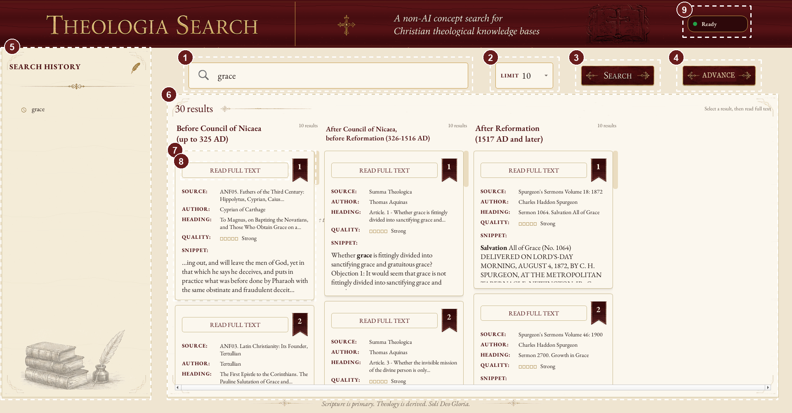

# Theologia Search

Theologia Search is a deterministic search application for a source-faithful
collection of Christian theological books. It retrieves and ranks evidence from
a local SQLite index. It does not generate theological conclusions, summaries,
or answers with an AI model.

This folder is the retrieval and application layer. The factual knowledge base
is maintained separately and supplies the source evidence, citations, and
metadata used to build the index.

## 1. Project Overview

### Aim

The project makes a large historical theology collection searchable while
keeping every result traceable to its source. Search expansion, morphology,
ranking, author periods, and result clusters are deterministic retrieval aids.
They do not replace reading the cited passage or make a doctrinal judgment.

### Current database

The current primary index contains:

- 66 author-period records.
- 287 indexed source volumes.
- 277 volumes with evidence records.
- 118,242 evidence records.
- 882 registered search terms.
- 31 configured morphology forms and 326,782 morphology matches.
- 5,061 mentioned-author links covering 60 distinct mentioned authors.
- Three historical result groups:
  - Before the Council of Nicaea, up to 325 AD.
  - After the Council of Nicaea and before the Reformation, 326-1516 AD.
  - After the Reformation, 1517 AD and later.

For a complete author and volume listing, see [CATALOG.txt](CATALOG.txt).

### What users receive

Users receive ranked evidence passages with source title, author, heading,
snippet, evidence ID, and context actions. Regular search returns up to the
selected limit independently within each historical period. Advanced search can
combine concept, author, mentioned author, period, book, and chapter metadata.

The work author and mentioned author are separate concepts. A passage in
Augustine's *City of God* that discusses Origen remains attributed to Augustine
for historical grouping and period classification, while Origen remains
searchable through the Mentioned author field.

The installer contains the searchable index and application resources. It does
not contain the raw knowledge-base repository or original book PDFs.

### Search policy

- No AI models or embeddings are used for retrieval.
- No generated theological summaries or conclusions are stored.
- Query expansion is human-curated and deterministic.
- Morphology and term-family matching are conservative search aids.
- SQLite is a generated index and should be rebuilt from the KB rather than
  edited manually.

## 2. Build and Install

### Build-machine prerequisites

The build process targets Windows 10 and Windows 11. The build machine needs:

- Python.
- PySide6, installed from `requirements-gui.txt`.
- PyInstaller, installed from `requirements-build.txt`.
- Inno Setup 6.
- The generated SQLite index at `generated/semantic_index.sqlite`.

End users do not need Python, pip, PySide6, PyInstaller, Inno Setup, or an
internet connection.

Install the Python build requirements:

```powershell
python -m pip install -r ./requirements-gui.txt
python -m pip install -r ./requirements-build.txt
```

### Create the installer

From this `theologia_search` folder, run:

```powershell
./installer/build_installer.ps1 -PythonExe ".\.venv\Scripts\python.exe"
```

The script validates the SQLite manifest, creates the PyInstaller application
folder, validates the packaged payload, runs the executable startup self-test,
and invokes Inno Setup.

It recreates these generated folders automatically:

```text
build/
dist/
release/
```

The final installer is:

```text
release/Theologia Search Setup.exe
```

Precompiled installers and separately downloadable SQLite datasets are
available in the [Theologia Search Google Drive folder](https://drive.google.com/drive/folders/1x_SvgpoRQ66EpoEqnhqHMTMm7rVF3y-g?usp=drive_link).

The installer includes the Python runtime, PySide6 and Qt libraries, the SQLite
database, search configuration, fonts, artwork, README, and `CATALOG.txt`.
The current installed payload is approximately 1.9 GB; the compressed setup file
is substantially smaller.

### Install and distribute

The installer uses a per-user default location under:

```text
%LOCALAPPDATA%/Theologia Search
```

The user can choose another installation directory in the wizard. The installer
creates a Start Menu shortcut and offers an optional Desktop shortcut. It also
registers a normal Windows uninstaller.

The setup executable can be uploaded to Google Drive or another file-sharing
service as the sole distribution file. Set the sharing permission so recipients
can download it. Users only need to download and run the setup file; they do not
need the repository or the original SQLite file.

## 3. Using the Installed Qt GUI

The packaged application launches as `TheologiaSearch.exe`. The Python
development launch is described in the next section.



The screenshot uses numbered dotted callouts without overlaid explanatory text.
The numbered areas are:

1. Search field.
2. Result limit. The limit applies independently to each historical section.
3. Regular search button.
4. Advanced search button.
5. Search history.
6. Historical period sections.
7. A result card with citation, author, heading, quality, and snippet.
8. Full-context action.
9. Application status.

### Regular search

1. Enter a word or phrase in the Search field, such as `grace` or
   `relationship between three persons in trinity`.
2. Choose a result limit. A limit of `10` means up to 10 results in each
   historical period, not 10 total.
3. Select Search or press Enter.
4. Read the three period columns independently. An empty period is meaningful
   only when the requested concept and filters have no matching evidence there.

Results show the source, work author, heading, quality label, score, and a
highlighted snippet. The score is a bounded comparison score for the same
query; it is not a probability or a measure of theological truth.

### Result details

- **Source** identifies the indexed volume.
- **Author** is the work or evidence author used for historical grouping.
- **Heading** identifies the chapter or section when available.
- **Quality** reports the strength of literal, structural, morphology, and
  curated-term matches.
- **Snippet** provides local evidence context and highlighted matches.
- **Read Full Text** opens the surrounding source context from the index.

Search history appears in the left panel. It is saved per Windows user at:

```text
%LOCALAPPDATA%/Theologia Search/gui_search_history.json
```

History is separate from the read-only bundled database. Clearing history does
not change the index.

### Advanced search

Select Advanced to combine metadata fields with a concept search. The available
fields are:

- **Concept or phrase**: the deterministic text search query.
- **Author**: the work or evidence author.
- **Mentioned author**: a person discussed in the evidence, separate from the
  work author.
- **Period**: the historical period of the work author.
- **Book**: source volume or book title.
- **Chapter**: chapter or section heading.

Each metadata field has an `AND` or `OR` connector. `AND` requires the selected
metadata branches to match together. `OR` accepts a row when at least one
branch matches. Text fields use case-insensitive token-substring matching.
Numeric chapter terms use complete-token matching, so chapter `29` does not
match chapter `129`.

Metadata-only searches are supported. An explicitly selected period is a hard
scope; an unrestricted search still shows the period sections independently.

### Reading historical results correctly

Historical grouping follows the work author. Mentioned or discussed authors do
not change the period of the work. For example, Origen can appear in the
Mentioned author field for a passage from Augustine's *City of God*, but the
result remains in the Nicene-to-Reformation grouping because Augustine wrote the
work after Nicaea.

## 4. Python GUI Development and Debugging

### Install GUI dependencies

```powershell
python -m pip install -r ./requirements-gui.txt
```

### Launch the Qt GUI

From this folder:

```powershell
python ./qt_gui.py
```

The Qt GUI reads the default index from:

```text
generated/semantic_index.sqlite
```

It also requires:

```text
generated/index_manifest.json
concept_query_lexicon.json
assets/fonts/
assets/png/
```

The SQLite file is intentionally ignored by Git because it is approximately
1.9 GB. It must be obtained separately when setting up a fresh checkout; it is
not downloaded automatically by `git clone`.

For a source checkout, the only large data file that must be supplied outside
Git is the SQLite database. Place it here before launching the GUI:

```text
generated/semantic_index.sqlite
```

Download the SQLite database from the [Theologia Search Google Drive folder](https://drive.google.com/drive/folders/1x_SvgpoRQ66EpoEqnhqHMTMm7rVF3y-g?usp=drive_link).

The matching `generated/index_manifest.json` must also be present beside it.
That manifest is small and is tracked in this repository, but replace it with
the matching manifest whenever the SQLite file comes from a different index
build. No other dataset download is required: the lexicon, fonts, artwork,
search code, and optional generated search metadata are already part of the
repository.

Both files contain the same embedded `dataset_version`. The version is a
release label, not part of either filename. After downloading or replacing a
dataset, print both values from the repository root:

```powershell
python -c 'import json,sqlite3; m=json.load(open("generated/index_manifest.json",encoding="utf-8")); c=sqlite3.connect("generated/semantic_index.sqlite"); print("Manifest:", m.get("dataset_version")); print("SQLite:", c.execute("select value from metadata where key=''dataset_version''").fetchone()[0])'
```

The two values must match. Do not edit only the manifest to make an unrelated
SQLite file appear valid; the manifest and database must be generated or
distributed as a matched pair.

### Downloading a newer released dataset

1. Download the newer SQLite database and its matching `index_manifest.json`
   from the [Theologia Search Google Drive folder](https://drive.google.com/drive/folders/1x_SvgpoRQ66EpoEqnhqHMTMm7rVF3y-g?usp=drive_link).
2. Replace both `generated/semantic_index.sqlite` and
   `generated/index_manifest.json`.
3. Do not mix files from different downloads.
4. Open the manifest and confirm its `dataset_version`.
5. Run the command above and confirm the SQLite value is identical.
6. Check synchronization:

```powershell
python ./check_index_sync.py
```

7. Run the search tests before launching the GUI:

```powershell
python -m unittest discover -s tests -q
```

Alternatively, keep the database elsewhere and pass its full path with the
CLI `--index` option or the Python `index_path` argument. The packaged
installer already includes the SQLite database and does not require this
separate setup step.

### Launch the legacy Tkinter GUI

```powershell
python ./gui.py
```

The Tkinter interface remains available as a fallback. The Qt interface is the
packaged and recommended desktop application.

### Use an external index from Python

The GUI helpers accept an explicit index path. This is useful when the database
is stored outside the repository:

```python
from pathlib import Path
from gui import run_search

output = run_search(
    "grace",
    index_path=Path(r"..\data\semantic_index.sqlite"),
    lexicon_path=Path("concept_query_lexicon.json"),
    period_sections=True,
    limit=10,
)
for row in output.results:
    print(row["evidence_id"], row["author"], row["snippet"])
```

For the CLI, use the same external database with `--index`:

```powershell
python ./search.py --index "../data/semantic_index.sqlite" --concept "grace"
```

### Debugging checklist

- **Missing semantic index**: place `semantic_index.sqlite` under `generated/`,
  or pass an explicit external path.
- **Missing lexicon**: restore `concept_query_lexicon.json` from the repository.
- **Stale manifest**: run `check_index_sync.py` and rebuild the index.
- **SQLite error or damaged index**: replace the database with a fresh build;
  do not patch the SQLite file manually.
- **PySide6 import error**: install `requirements-gui.txt` in the Python
  environment used to launch the GUI.
- **Startup resource error**: confirm the assets, lexicon, manifest, and database
  paths are beside the source or packaged application.
- **History permission error**: confirm the current Windows user can write to
  `%LOCALAPPDATA%/Theologia Search`.

Run the regression tests with:

```powershell
python -m unittest discover -s tests -q
```

## 5. CLI and Python API

### Basic CLI search

```powershell
python ./search.py --concept "grace" --period-sections --limit 10
```

Useful examples:

```powershell
# Search and show deterministic expansion
python ./search.py --concept "relationship between three persons in trinity" --period-sections --cluster-results --show-expansion --limit 10

# Show raw terms, mechanical variants, phrases, and FTS terms
python ./search.py --concept "animal soul" --show-query-plan

# Filter by work author
python ./search.py --concept "grace" --author "Augustine of Hippo" --limit 10

# Filter by mentioned or discussed author
python ./search.py --concept "doctrine" --mentioned-author "Origen" --limit 10

# Filter by source ID, source title, PDF path, or unique substring
python ./search.py --concept "grace" --source "NPNF1_02" --limit 10

# Filter by heading or outline section
python ./search.py --concept "grace" --section "City of God" --limit 10

# Emit machine-readable JSON Lines
python ./search.py --concept "grace" --period-sections --jsonl --limit 10

# Omit snippets from readable output
python ./search.py --concept "grace" --no-snippet --limit 10

# Add corpus-derived neighboring terms
python ./search.py --concept "trinity" --cooccurrence-expansion --show-expansion

# Show recurring nearby phrases for human review
python ./search.py --concept "animal soul" --show-discovered-phrases
```

The CLI supports `--source`, `--author`, `--authors`,
`--mentioned-author`, `--mentioned-authors`, `--section`, `--limit`,
`--candidate-limit`, `--period-sections`, `--cluster-results`,
`--show-expansion`, `--show-query-plan`, `--show-discovered-phrases`,
`--cooccurrence-expansion`, `--jsonl`, `--no-snippet`, and
`--rebuild-index`.

The full combination of advanced metadata fields is available through the Qt
dialog and Python API. The CLI's `--section` option is the direct command-line
heading/chapter filter.

### Python API

The main retrieval API is in `search.py`:

- `search_concept(...)`: search one concept against a database connection.
- `search_concept_by_period(...)`: return independent period-grouped results.
- `search_advanced(...)`: combine concept and metadata criteria.
- `search_advanced_by_period(...)`: run advanced search independently by period.
- `AdvancedSearchCriteria`: structured concept, author, mentioned-author,
  period, book, chapter, and connector inputs.
- `load_lexicon(...)`: load the curated query expansion file.
- `validate_advanced_criteria(...)`: validate advanced criteria.
- `configure_search_connection(...)`: configure SQLite search behavior.

Typical integration code:

```python
import json
import sqlite3
from pathlib import Path

import search

index_path = Path("generated/semantic_index.sqlite")
lexicon = search.load_lexicon(Path("concept_query_lexicon.json"))
with sqlite3.connect(index_path) as con:
    con.row_factory = sqlite3.Row
    groups, expansion = search.search_concept_by_period(
        con,
        "grace",
        lexicon,
        limit=10,
    )
    for group in groups:
        for row in group["results"]:
            print(json.dumps({
                "period": group["period_id"],
                "evidence_id": row["evidence_id"],
                "author": row["author"],
                "source_title": row["source_title"],
                "heading": row["heading"],
                "snippet": row["snippet"],
                "score": row["concept_score"],
            }, ensure_ascii=False))
```

Result rows preserve source-faithful fields including `evidence_id`,
`source_id`, `source_title`, `pdf_file`, `author`,
`author_period_id`, `author_period_label`, `mentioned_authors`,
`page_number`, `heading`, `outline_path`, `verbatim_text`, and
`snippet`. Diagnostic fields include `concept_score`, `quality_label`,
`quality_grade`, `matched_raw_terms`, `matched_registered_terms`,
`matched_lemmas`, `matched_morphology_forms`,
`matched_term_families`, `raw_phrase_matches`, and
`proximity_matches`.

### Future AI integration

An AI application can use this API as a retrieval and citation layer:

1. Send the user's question or concept to deterministic search.
2. Apply author, mentioned-author, period, book, or chapter filters when known.
3. Pass returned evidence text and citation fields to the AI as context.
4. Require citations using `evidence_id`, author, source title, heading, and
   snippet.

The AI should treat scores as ranking signals, not truth values. It should not
invent claims when no evidence is returned, and it should preserve the
work-author versus mentioned-author distinction.

## 6. Updating the SQLite Index from the External KB

The factual knowledge base is maintained in a separate repository. This
repository reads that KB and creates a generated SQLite retrieval index. The
search project does not edit `christian_kb_*` source files.

### Standard rebuild

Assuming the KB repository is available at a relative path such as
`../knowledge_base`:

```powershell
python ./build_index.py --kb-dir "../knowledge_base"
```

The default output is:

```text
generated/semantic_index.sqlite
generated/index_manifest.json
```

The default layer is `primary`. Other supported layers are:

```powershell
python ./build_index.py --kb-dir "../knowledge_base" --layer extended
python ./build_index.py --kb-dir "../knowledge_base" --layer archival
python ./build_index.py --kb-dir "../knowledge_base" --layer all
```

### Check and synchronize

Check whether the current SQLite index matches the KB:

```powershell
python ./check_index_sync.py --kb-dir "../knowledge_base"
```

Rebuild automatically when the index is missing or stale:

```powershell
python ./check_index_sync.py --kb-dir "../knowledge_base" --sync
```

The check compares schema, builder version, KB generation timestamp, layer,
author-period metadata, and other manifest values. It does not patch the SQLite
file in place.

### After a rebuild

1. Confirm the manifest and evidence counts.
2. Run the full regression suite.
3. Run representative regular and advanced searches.
4. Verify author and mentioned-author behavior.
5. Run `check_index_sync.py` again.
6. Rebuild the Windows installer so the new SQLite file is bundled:

```powershell
./installer/build_installer.ps1 -PythonExe ".\.venv\Scripts\python.exe"
```

When building a newer dataset release, first update the `DATASET_VERSION`
constant in `build_index.py`, for example from `1.0.0` to `1.1.0`:

```python
DATASET_VERSION = "1.1.0"
```

Then rebuild from the external KB:

```powershell
python ./build_index.py --kb-dir "../knowledge_base"
```

The build regenerates the normal paths `generated/semantic_index.sqlite` and
`generated/index_manifest.json`, writing the same configured version into both.
Confirm the two embedded values with the command in the source-checkout
section, run synchronization and regression tests, and rebuild the installer
if the new dataset will be distributed. The runtime checks only that the two
embedded values agree; it does not require a particular version number or a
versioned filename.

Do not manually edit the SQLite database to correct KB attribution or metadata.
Fix the source KB or its builder, rebuild the affected KB data, and then rebuild
the search index.
